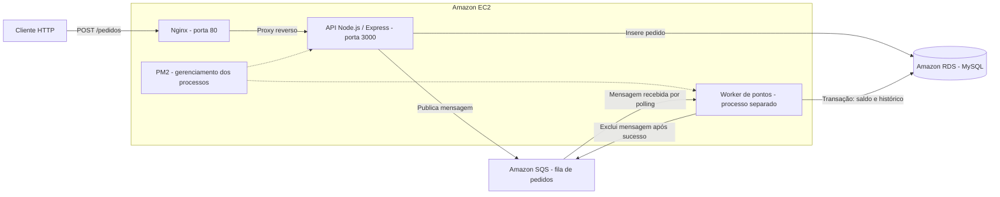
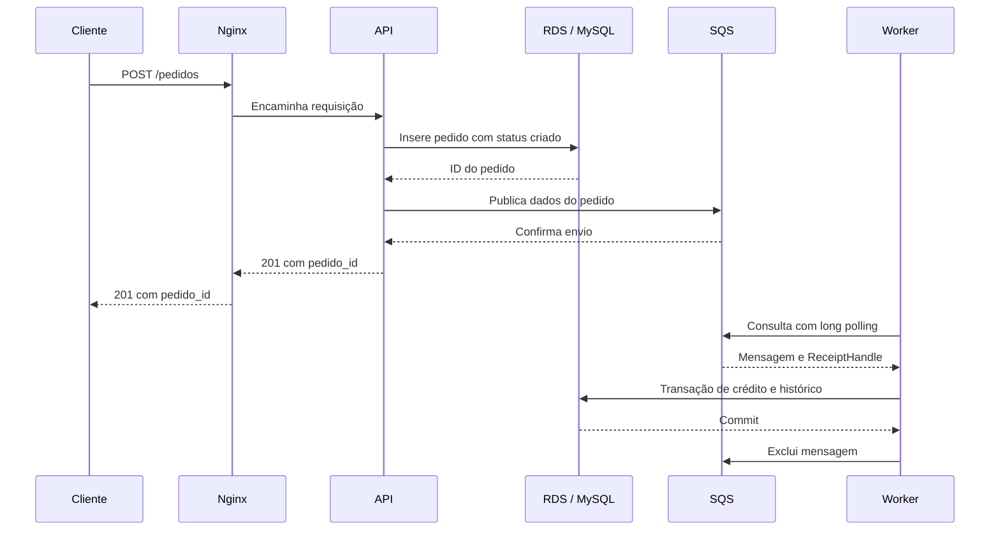

# Serviço de Pedidos e Recompensas

Serviço que registra pedidos e processa a concessão de pontos aos usuários de forma assíncrona. A API recebe o pedido, persiste os dados e publica uma mensagem; um worker separado consome essa mensagem e atualiza o saldo de pontos.

O projeto está hospedado em uma **instância Amazon EC2**, utiliza **Amazon SQS** para mensageria e mantém o banco **MySQL no Amazon RDS**. O **Nginx** recebe o tráfego HTTP e encaminha as requisições para a aplicação Node.js. O **PM2** gerencia os processos da API e do worker na EC2.

Esta documentação descreve a implementação do repositório e a configuração de Nginx fornecida para o projeto. Configurações externas não versionadas, como regras de rede, atributos da fila, backups e certificados, precisam ser consultadas no ambiente AWS.

## Índice

- [Arquitetura do sistema](#arquitetura-do-sistema)
- [Fluxo de criação de pedidos](#fluxo-de-criação-de-pedidos)
- [Processamento de pontos](#processamento-de-pontos)
- [Organização do código](#organização-do-código)
- [Banco de dados no RDS](#banco-de-dados-no-rds)
- [Mensageria com SQS](#mensageria-com-sqs)
- [Papel do Nginx](#papel-do-nginx)
- [Contrato HTTP](#contrato-http)
- [Configuração e execução](#configuração-e-execução)
- [Deploy na EC2](#deploy-na-ec2)
- [Operação e diagnóstico](#operação-e-diagnóstico)
- [Garantias e limites da arquitetura](#garantias-e-limites-da-arquitetura)
- [Referências](#referências)

## Arquitetura do sistema

### Visão geral



A API e o worker são executáveis independentes, embora compartilhem o código de infraestrutura e o banco. A comunicação entre eles ocorre pelo SQS; a API não chama o worker diretamente.

### Responsabilidades dos componentes

| Componente | Responsabilidade |
| --- | --- |
| Amazon EC2 | Hospedar o Nginx e os processos Node.js da aplicação. |
| Nginx | Receber HTTP, encaminhar as requisições e limitar o tráfego no caminho de pedidos. |
| API Express | Expor o endpoint de criação de pedidos e coordenar persistência e publicação. |
| Amazon RDS / MySQL | Armazenar pedidos, saldos de usuários e histórico de pontos. |
| Amazon SQS | Manter as mensagens para processamento assíncrono pelo worker. |
| Worker | Consumir mensagens, calcular pontos e persistir o crédito. |
| PM2 | Iniciar e reiniciar os processos `api` e `worker`. |
| GitHub Actions | Automatizar a entrega da aplicação para a EC2 a partir da branch `prod`. |

### Separação entre resposta HTTP e processamento assíncrono

A criação do pedido tem duas etapas síncronas: gravação no MySQL e envio ao SQS. A resposta HTTP é enviada depois dessas duas operações, sem aguardar o crédito dos pontos.

Essa separação permite que o worker processe mensagens no próprio ritmo. Se ele estiver parado, a API pode continuar criando pedidos enquanto o RDS e o SQS estiverem disponíveis; as mensagens ficam pendentes, sujeitas ao período de retenção configurado na fila.

O saldo de pontos apresenta **consistência eventual** em relação à criação do pedido: receber `201 Created` não significa que os pontos já foram creditados.

## Fluxo de criação de pedidos

1. O cliente envia `POST /pedidos` com `usuario_id` e `valor_total` em JSON.
2. O Nginx aplica o controle de tráfego e encaminha a requisição para o Node.js.
3. O Express interpreta o JSON e direciona a chamada ao controller.
4. O controller delega a operação ao `CriarPedidoUseCase`.
5. O `PedidosRepository` insere o pedido no RDS, com status `criado` e data de criação gerada pela aplicação.
6. O caso de uso obtém o identificador inserido e solicita ao `SQSService` a publicação da mensagem.
7. A mensagem contém `pedido_id`, `usuario_id` e `valor_total`.
8. Após o envio ao SQS concluir, a API responde `201 Created` com `pedido_id`.



A sequência representa o fluxo usual. Como os processos são independentes, o worker pode começar a consumir a mensagem assim que ela estiver disponível, inclusive antes de o cliente receber a resposta.

## Processamento de pontos

O ponto de entrada `src/worker.ts` monta as dependências e inicia um loop contínuo. O worker não expõe rotas HTTP.

Em cada execução, o `ProcessarPontosUseCase`:

1. Consulta o SQS.
2. Verifica se a mensagem possui corpo e identificador de recebimento (`ReceiptHandle`).
3. Interpreta o corpo JSON e extrai os dados do pedido.
4. Calcula os pontos.
5. Solicita ao repositório a atualização do saldo e a gravação do histórico.
6. Exclui a mensagem do SQS somente depois de concluir a transação no banco.

### Regra de pontuação

O usuário recebe **1 ponto para cada 10 unidades de valor do pedido**, arredondando o resultado para baixo:

**Pontos = piso(valor total ÷ 10)**

| Valor total | Pontos calculados |
| --- | ---: |
| 9,90 | 0 |
| 10,00 | 1 |
| 99,90 | 9 |
| 150,00 | 15 |

Pedidos que resultam em zero pontos também passam pelo fluxo de atualização e gravação de histórico. Não existe uma condição no caso de uso para descartá-los.

### Transação de crédito

O `UsuariosRepository` inicia uma transação no MySQL para incrementar `usuarios.saldo_pontos` e inserir o registro em `historico_pontos`, com operação `credito` e motivo no formato `Pedido <pedido_id>`.

Se não houver usuário correspondente, o repositório lança um erro. Se qualquer operação falhar, a transação é revertida. Quando ambas concluem, ocorre o commit.

O incremento é realizado diretamente no banco, evitando uma leitura do saldo seguida de escrita do valor calculado na aplicação. A atomicidade entre saldo e histórico depende de tabelas com suporte a transações, como InnoDB.

## Organização do código

O projeto usa uma arquitetura em camadas, com regras de negócio dependentes de interfaces e implementações concretas conectadas por injeção de dependências.

```text
src/
├── app.ts
├── server.ts
├── worker.ts
├── controllers/
│   └── CriarPedidoController.ts
├── database/
│   └── knex.ts
├── factories/
│   └── makeCriarPedidoController.ts
├── interfaces/
│   ├── IMessagingService.ts
│   ├── IPedido.ts
│   ├── IPedidosRepository.ts
│   └── IUsuariosRepository.ts
├── repositories/
│   ├── PedidosRepository.ts
│   └── UsuariosRepository.ts
├── routes/
│   └── index.ts
├── services/
│   └── SQSService.ts
└── useCases/
    ├── CriarPedidoUseCase.ts
    └── ProcessarPontosUseCase.ts
```

| Camada / arquivo | Função |
| --- | --- |
| `interfaces/` | Definir contratos dos repositórios e da mensageria, além da estrutura de pedido. |
| `useCases/` | Coordenar as regras de criação de pedido e processamento de pontos. |
| `repositories/` | Concentrar o acesso às tabelas usando a instância compartilhada do Knex. |
| `services/` | Encapsular a integração com o AWS SDK para enviar, receber e excluir mensagens. |
| `controllers/` | Adaptar a requisição e a resposta HTTP ao caso de uso. |
| `factories/` | Instanciar e conectar as dependências da API. |
| `routes/` | Mapear o endpoint HTTP para o controller. |
| `database/knex.ts` | Configurar a conexão MySQL a partir das variáveis de ambiente. |
| `app.ts` | Carregar o ambiente, configurar o parser JSON e registrar as rotas. |
| `server.ts` | Iniciar o servidor HTTP. |
| `worker.ts` | Montar as dependências do consumidor e manter o processamento contínuo. |

Os casos de uso dependem de `IPedidosRepository`, `IUsuariosRepository` e `IMessagingService`, conforme a operação. Eles não importam as implementações do Knex ou do AWS SDK. Na API, a factory realiza a composição; no worker, essa composição ocorre no próprio ponto de entrada.

Não há diretórios implementados de middlewares, utilitários ou migrations neste repositório.

### Tecnologias

- **Node.js e TypeScript:** execução e desenvolvimento da aplicação; o contexto do projeto indica Node.js 20 como referência.
- **Express:** servidor e roteamento HTTP.
- **Knex e mysql2:** construção de consultas e comunicação com o MySQL.
- **AWS SDK for JavaScript v3:** integração com SQS.
- **dotenv:** carregamento das variáveis de ambiente.
- **tsx:** execução de TypeScript com acompanhamento de alterações durante o desenvolvimento.
- **Nginx e PM2:** componentes instalados no servidor de produção, externos às dependências npm.

As dependências estão declaradas em `package.json`; o `package-lock.json` registra as versões resolvidas. O TypeScript compila os arquivos de `src/` para `dist/`.

## Banco de dados no RDS

O Amazon RDS hospeda o banco MySQL usado pelos dois processos. A API grava pedidos; o worker atualiza usuários e insere históricos. O endpoint do RDS é informado por `DB_HOST`.

### Estruturas utilizadas

| Tabela | Campos utilizados ou representados no código | Papel |
| --- | --- | --- |
| `pedidos` | `id`, `usuario_id`, `valor_total`, `status`, `data_criacao` | Registro do pedido recebido pela API. |
| `usuarios` | `id`, `saldo_pontos` | Identificação do usuário e saldo acumulado. |
| `historico_pontos` | `usuario_id`, `pontos`, `operacao`, `motivo` | Registro do crédito realizado pelo worker. |

Essa descrição corresponde ao contrato esperado pelo código. O repositório não inclui o DDL, migrations ou seeds; tipos SQL, índices, chaves estrangeiras, campos adicionais e valores padrão devem ser verificados no banco existente.

O usuário precisa existir para que o worker consiga creditar os pontos. A API não verifica explicitamente a existência dele antes de criar o pedido; eventuais restrições nessa etapa dependem do esquema do banco.

### Acesso e infraestrutura

A EC2 precisa alcançar o endpoint do RDS na porta configurada, normalmente `3306`. Como configuração recomendada, o Security Group do RDS deve permitir essa conexão apenas a partir do Security Group da aplicação, e o usuário MySQL deve ter permissões compatíveis com as operações necessárias.

Topologia de sub-redes, acesso público, Multi-AZ e políticas de backup são propriedades da infraestrutura e não estão definidas neste repositório. A configuração de conexão atual também não declara opções de TLS para o MySQL.

## Mensageria com SQS

O SQS desacopla a criação do pedido do processamento de recompensas. O `SQSService` utiliza a URL definida em `SQS_QUEUE_URL` e serializa o corpo da mensagem em JSON com os campos:

| Campo | Significado |
| --- | --- |
| `pedido_id` | Identificador do pedido persistido. |
| `usuario_id` | Usuário que deve receber o crédito. |
| `valor_total` | Valor usado para calcular os pontos. |

O worker calcula os pontos usando o valor recebido na mensagem; ele não consulta novamente o pedido no banco.

### Recebimento e confirmação

O recebimento utiliza **long polling de até 20 segundos**. A consulta pode retornar antes desse prazo quando uma mensagem estiver disponível, reduzindo consultas vazias quando a fila está ociosa. Esse funcionamento é descrito na [documentação oficial de long polling do SQS](https://docs.aws.amazon.com/AWSSimpleQueueService/latest/SQSDeveloperGuide/sqs-short-and-long-polling.html).

Ao receber uma mensagem, o worker usa o `ReceiptHandle` daquela entrega para excluí-la depois do crédito. Receber uma mensagem não a remove da fila.

### Falhas e reentrega

Se o processamento falhar, o worker registra o erro, espera cinco segundos e retoma o loop. A mensagem não é excluída nessa tentativa. A possibilidade e o momento de uma nova entrega dependem dos atributos da fila, incluindo visibility timeout, retenção e política de redirecionamento para uma dead-letter queue (DLQ).

O código não configura esses atributos nem altera o visibility timeout durante o processamento. Eles precisam ser definidos na infraestrutura. O prazo de invisibilidade deve ser suficiente para a operação no banco e a exclusão da mensagem.

A implementação não envia parâmetros específicos de FIFO, como identificador de grupo ou deduplicação. O tipo e os atributos da fila efetivamente criada devem ser conferidos na AWS.

Em filas Standard, pode haver entrega repetida. A AWS recomenda consumidores idempotentes, conforme a [documentação de entrega pelo menos uma vez](https://docs.aws.amazon.com/AWSSimpleQueueService/latest/SQSDeveloperGuide/standard-queues-at-least-once-delivery.html). O worker atual não verifica se aquele pedido já gerou crédito, portanto uma reentrega pode somar pontos novamente.

## Papel do Nginx

O Nginx fica à frente da API na EC2. A configuração fornecida recebe HTTP na **porta 80**, tanto em IPv4 quanto em IPv6, como servidor padrão, e encaminha o tráfego para **`127.0.0.1:3000`**.

### Proxy reverso

Para o cliente, o endereço de acesso é o servidor HTTP do Nginx. Internamente, ele repassa a requisição ao Express e devolve a resposta ao cliente.

O caminho geral encaminha as rotas ao Node.js, enquanto o caminho de pedidos possui tratamento específico para controle de tráfego. A configuração preserva o cabeçalho `Host` e utiliza HTTP/1.1 na comunicação com o processo Node.js.

Na rota geral, há encaminhamento de cabeçalhos de upgrade de conexão, compatível com cenários que exigem esse mecanismo, e uma instrução para ignorar cache em requisições de upgrade. Isso não significa que a aplicação implemente WebSockets ou que exista um cache ativo: nenhum desses recursos está definido no código analisado.

### Rate limiting no caminho de pedidos

O Nginx mantém uma zona compartilhada de **10 MB**, identificada como `rate_limit_pedidos`, para acompanhar as requisições pelo endereço IP de origem.

A política permite uma taxa média de **5 requisições por segundo por IP**, com tolerância de **10 requisições excedentes em rajadas**. As requisições aceitas dentro dessa tolerância são encaminhadas imediatamente, pois o comportamento configurado não adiciona atraso. Quando a tolerância se esgota, o Nginx rejeita novas requisições; a capacidade é recuperada conforme a taxa configurada. O excesso retorna **HTTP 503** por padrão, pois a configuração fornecida não redefine esse status. Consulte a [documentação oficial do módulo de rate limiting](https://nginx.org/en/docs/http/ngx_http_limit_req_module.html).

O controle reduz rajadas de tráfego antes que elas cheguem ao Node.js, ao RDS e ao SQS. Ele atua por IP e por caminho: o bloco `/pedidos` é uma correspondência por prefixo e não restringe o controle somente ao método `POST`.

Clientes que compartilham um IP público também compartilham esse limite. Se houver um proxy ou balanceador adicional à frente do Nginx, a identificação do IP real precisa ser configurada para que o controle acompanhe corretamente os clientes.

### Redução de informações expostas

A configuração desabilita a divulgação da versão do Nginx em suas respostas e páginas de erro e remove o cabeçalho `X-Powered-By` das respostas encaminhadas pela API. Essas medidas reduzem a exposição de detalhes da stack.

### Alcance da configuração fornecida

O trecho fornecido configura HTTP na porta 80; não apresenta terminação TLS/HTTPS, balanceamento entre múltiplas instâncias ou encaminhamento explícito de cabeçalhos de IP e protocolo original. Esses recursos, se existentes no ambiente, precisam ser documentados a partir da infraestrutura correspondente.

O Node.js não define um endereço de bind explícito ao iniciar o servidor. Embora o Nginx use o endereço local como destino, isso não garante que a porta `3000` esteja acessível apenas localmente. Para preservar o caminho de entrada pelo Nginx e seu rate limiting, a exposição dessa porta deve ser restringida pelas regras de rede ou pela configuração de escuta.

## Contrato HTTP

### Criar pedido

**Método e caminho:** `POST /pedidos`  
**Formato:** JSON, com cabeçalho `Content-Type: application/json`.

| Campo de entrada | Tipo esperado | Descrição |
| --- | --- | --- |
| `usuario_id` | Número | Identificador do usuário. |
| `valor_total` | Número | Valor total do pedido. |

Exemplo de corpo:

```json
{
  "usuario_id": 1,
  "valor_total": 150
}
```

Exemplo de resposta bem-sucedida, com status **201 Created**:

```json
{
  "pedido_id": 123
}
```

O identificador depende do registro criado no banco. Os pontos não são retornados pela API e devem ser processados pelo worker.

Existe apenas essa rota no repositório. Não há endpoints implementados para consultar pedidos, saldos, histórico ou saúde da aplicação.

Os tipos TypeScript expressam o contrato de desenvolvimento, mas não validam o JSON recebido em tempo de execução. Não há validação explícita de campos obrigatórios, valor positivo ou usuário existente, nem autenticação, autorização ou resposta de erro padronizada por middleware próprio.

## Configuração e execução

### Pré-requisitos

- Node.js e npm compatíveis com as dependências do projeto.
- Banco MySQL com as tabelas esperadas já criadas e um usuário disponível para os pedidos de teste.
- Fila SQS acessível, região AWS configurada e credenciais com as permissões necessárias.
- Conectividade com o banco e com o serviço SQS.

O desenvolvimento local também utiliza SQS: não há adaptador de fila em memória nem configuração de emulador neste repositório.

### Variáveis de ambiente

Crie um arquivo `.env` na raiz com os valores do seu ambiente. Esse arquivo é ignorado pelo Git. Não inclua credenciais reais na documentação ou no controle de versão.

| Variável | Uso | Comportamento atual |
| --- | --- | --- |
| `PORT` | Porta da API. | Padrão `3000`; deve coincidir com o destino do Nginx em produção. |
| `DB_HOST` | Host MySQL; em produção, endpoint do RDS. | Padrão `localhost`. |
| `DB_PORT` | Porta MySQL. | Padrão `3306`. |
| `DB_USER` | Usuário do banco. | Padrão `root`. |
| `DB_PASSWORD` | Senha do banco. | Padrão vazio. |
| `DB_NAME` | Nome do banco. | Padrão vazio; configure o banco correto. |
| `AWS_REGION` | Região usada pelo AWS SDK. | Deve ser resolvida pela configuração AWS; o código não fixa uma região. |
| `AWS_ACCESS_KEY_ID` | Identificador da credencial AWS por ambiente. | Injetado pelo workflow atual. |
| `AWS_SECRET_ACCESS_KEY` | Segredo da credencial AWS por ambiente. | Injetado pelo workflow atual. |
| `AWS_SESSION_TOKEN` | Token quando se usam credenciais temporárias por ambiente. | Reconhecido pelo SDK; não é injetado pelo workflow atual. |
| `SQS_QUEUE_URL` | URL da fila de pedidos. | Obrigatória nas operações de mensageria; a ausência gera erro. |

O cliente SQS não recebe credenciais diretamente no construtor e utiliza a resolução padrão do SDK. Em EC2, uma IAM Role associada à instância pode fornecer credenciais, desde que a configuração do ambiente permita essa resolução. O deploy versionado utiliza chaves de acesso armazenadas nos secrets do GitHub; a adoção de IAM Role é uma alternativa de evolução.

As ações SQS utilizadas são `sqs:SendMessage`, `sqs:ReceiveMessage` e `sqs:DeleteMessage`. As permissões devem ser limitadas à fila correspondente; requisitos adicionais dependem de sua configuração, como criptografia com chave KMS.

### Desenvolvimento local

Instale as dependências:

```bash
npm install
```

Em um terminal, inicie a API:

```bash
npm run dev
```

Em outro terminal, inicie o worker:

```bash
npm run worker
```

Os dois comandos usam acompanhamento de alterações. Apenas iniciar a API não processa os pontos; é necessário manter o worker ativo.

### Compilação e execução do JavaScript

```bash
npm run build
npm start
```

O build gera os arquivos em `dist/`, e `npm start` inicia somente a API. Para executar o worker compilado em outro terminal:

```bash
node dist/worker.js
```

Não existe uma suíte automatizada configurada: o script `npm test` é um placeholder que termina com erro.

## Deploy na EC2

O workflow [`.github/workflows/deploy-prod.yml`](.github/workflows/deploy-prod.yml) é acionado por um **push na branch `prod`**.

### Etapas automatizadas

1. O GitHub Actions faz checkout do repositório.
2. Copia os arquivos para `~/servico_pedidos` na EC2, via SCP.
3. Conecta à instância via SSH.
4. Gera o `.env` remoto usando os secrets do repositório.
5. Executa `npm install` e `npm run build` na EC2.
6. Reinicia o processo `api` ou, se necessário, inicia `dist/server.js` com esse nome.
7. Reinicia o processo `worker` ou inicia `dist/worker.js` com esse nome.
8. Executa `pm2 save` para salvar a lista de processos.

### Secrets utilizados

| Grupo | Secrets |
| --- | --- |
| Conexão com a instância | `EC2_HOST`, `EC2_USERNAME`, `EC2_SSH_KEY` |
| Banco RDS | `DB_HOST`, `DB_PORT`, `DB_USER`, `DB_PASSWORD`, `DB_NAME` |
| AWS e SQS | `AWS_REGION`, `AWS_ACCESS_KEY_ID`, `AWS_SECRET_ACCESS_KEY`, `SQS_QUEUE_URL` |

O workflow não injeta `PORT`, portanto a aplicação usa `3000` por padrão, correspondente ao proxy fornecido.

### Preparação externa necessária

A instância precisa ter Node.js, npm, PM2 e Nginx instalados, acesso SSH configurado, conectividade com o RDS e permissão para operar a fila. O arquivo de configuração do Nginx deve estar instalado e carregado no servidor.

O workflow não provisiona EC2, RDS ou SQS, não instala o Nginx ou o PM2, não cria as tabelas e não configura Security Groups ou certificados.

`pm2 save` preserva a lista de processos, mas a restauração automática após reiniciar a máquina exige a integração de startup do PM2 com o sistema operacional, configurada separadamente. O workflow também não inclui testes, verificação de saúde após o deploy ou rollback automatizado.

## Operação e diagnóstico

### Verificações após o deploy

1. Confirme no GitHub Actions que a cópia, a instalação e o build concluíram.
2. Consulte `pm2 status` e verifique os processos `api` e `worker`.
3. Consulte `pm2 logs api` e `pm2 logs worker` para identificar falhas de inicialização ou integração.
4. Envie um pedido com usuário existente e verifique a resposta `201`.
5. Confirme o registro em `pedidos`, o incremento esperado em `usuarios` e a entrada em `historico_pontos`.
6. Verifique se as mensagens estão sendo consumidas na fila SQS.

O pedido usado nessa verificação grava dados e pode conceder pontos; utilize um usuário e um ambiente apropriados.

### Sintomas comuns

| Sintoma | O que verificar |
| --- | --- |
| Nginx retorna erro de upstream, como `502` | Processo `api`, porta configurada e logs do Nginx. |
| `503` durante rajadas no caminho de pedidos | Rejeição pelo rate limiting nos logs do Nginx; outros erros também podem produzir esse status. |
| Pedido retorna `201`, mas os pontos demoram | Processo `worker`, mensagens pendentes, conexão com RDS e logs de processamento. |
| Erro de usuário não encontrado no worker | Existência do `usuario_id` no banco e conteúdo da mensagem. |
| Falha ao publicar ou receber mensagens | URL, região, credenciais, permissões IAM e conectividade com SQS. |
| Pedido existe, mas a requisição falhou | Possível falha no envio ao SQS depois da persistência; examine os logs antes de repetir a criação. |
| Mensagens reaparecem ou pontos são duplicados | Falhas de exclusão, visibility timeout e ausência de idempotência no consumidor. |

### Observabilidade

O código registra a inicialização da API, a inicialização do worker e erros capturados no loop do consumidor. Não há integração explícita com métricas ou rastreamento distribuído.

Para acompanhar o ambiente, são úteis os logs de acesso e erro do Nginx, os logs do PM2, a quantidade e a idade das mensagens pendentes no SQS e as métricas de conexões, CPU e armazenamento do RDS. A coleta centralizada e os alarmes precisam ser configurados externamente.

## Garantias e limites da arquitetura

### Garantias implementadas

- A resposta de sucesso acontece depois de persistir o pedido e concluir o envio da mensagem.
- A concessão de pontos ocorre em processo separado da API.
- O saldo e o histórico são alterados na mesma transação de banco.
- A exclusão da mensagem ocorre depois de concluir o crédito.
- O Nginx controla a taxa de requisições no caminho de pedidos conforme a política fornecida.

### Limites atuais

| Aspecto | Comportamento e consequência |
| --- | --- |
| Persistência e publicação | Não há transação distribuída entre RDS e SQS. Se a gravação funcionar e o envio falhar, o pedido permanece no banco sem publicação confirmada. |
| Idempotência da API | Não há chave de idempotência. Repetir uma requisição pode criar outro pedido. |
| Idempotência do worker | Não há controle de crédito por pedido. Reentregas podem duplicar pontos, inclusive se o commit funcionar e a exclusão no SQS falhar. |
| Estado do pedido | O worker não atualiza o status; o pedido permanece `criado` mesmo após o crédito. |
| Validação | Não há validação explícita dos dados da requisição nem do conteúdo de negócio da mensagem. |
| Mensagens com erro recorrente | A política de DLQ não é definida no repositório. Mensagens inválidas dependem da configuração da fila para tratamento posterior. |
| Disponibilidade | O deploy aponta API e worker para uma EC2. Não há definição versionada de múltiplas instâncias ou failover da aplicação. |
| Escala | A separação permite evoluir API e worker independentemente, mas o deploy atual não define autoscaling ou múltiplos consumidores. |
| Encerramento | Não há tratamento explícito de sinais para concluir operações em andamento e fechar conexões. |

### Evoluções possíveis

- Adotar **Transactional Outbox** para registrar o pedido e a intenção de publicação na mesma transação do banco, com envio posterior ao SQS.
- Tornar o consumidor idempotente, registrando uma identificação única do crédito por pedido na mesma transação que altera o saldo.
- Validar os dados HTTP e as mensagens antes de executar as regras de negócio.
- Definir DLQ, visibility timeout e alarmes compatíveis com o tempo de processamento.
- Padronizar erros, adicionar autenticação conforme o uso da API e disponibilizar verificações de saúde.
- Configurar HTTPS, restringir a exposição direta do Node.js e avaliar credenciais via IAM Role.
- Automatizar migrations, verificações de deploy e testes dos fluxos de sucesso, falha e reentrega.

Esses itens são possibilidades de evolução; não representam funcionalidades implementadas.

## Referências

- [Contexto e regras de arquitetura do projeto](PROJECT_CONTEXT.md).
- [Manifesto e scripts npm](package.json).
- [Workflow de deploy para EC2](.github/workflows/deploy-prod.yml).
- [Nginx: módulo de rate limiting](https://nginx.org/en/docs/http/ngx_http_limit_req_module.html).
- [Amazon SQS: short e long polling](https://docs.aws.amazon.com/AWSSimpleQueueService/latest/SQSDeveloperGuide/sqs-short-and-long-polling.html).
- [Amazon SQS: entrega pelo menos uma vez em filas Standard](https://docs.aws.amazon.com/AWSSimpleQueueService/latest/SQSDeveloperGuide/standard-queues-at-least-once-delivery.html).
